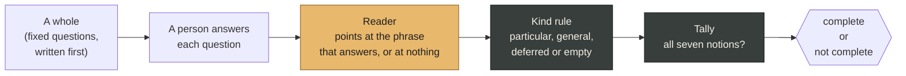

<p align="center">
  
</p>

<h1 align="center">rai</h1>

<p align="center"><strong>A model that checks if a set is complete.</strong></p>

<p align="center">
  <a href="https://github.com/koherarchitecture/rai/releases/tag/v0.3.2"></a>
  <a href="LICENSE"></a>
  <a href="LICENSE-WEIGHTS-AND-DATA.md"></a>
  
  <a href="https://huggingface.co/prayasabhinav/rai"></a>
</p>
<p align="center">
  
  
  
  
  
  
  <a href="https://splitdomaincognition.org"></a>
</p>

---

rai asks a fixed set of questions about one ordinary thing, reads each typed answer with a small model, and adds up the result in plain code. It says one word: **complete** or **not complete**. It does not say what is missing, suggest wording or show a number.

The model in rai only points. Given a question and an answer, it returns the phrase in the answer that answers the question, or nothing. It cannot write a word of its own. Every decision after that is made by code short enough to read in a few minutes.

The name is the Hindi word for a mustard seed, राई, the proverbial smallest thing.

## Contents

- [Quick start](#quick-start)
- [What it is for](#what-it-is-for)
- [Use cases](#use-cases)
- [How it works](#how-it-works)
- [Use it from Python](#use-it-from-python)
- [The seven notions of completeness](#the-seven-notions-of-completeness)
- [The wholes](#the-wholes)
- [How well the reader reads](#how-well-the-reader-reads)
- [What rai will never do](#what-rai-will-never-do)
- [Model, data and training](#model-data-and-training)
- [Repository layout](#repository-layout)
- [Licences and credit](#licences-and-credit)

## Quick start

```bash
git clone https://github.com/koherarchitecture/rai.git
cd rai
python3 -m venv .venv
.venv/bin/pip install -r requirements.txt

# the trained reader, 127 MB, from this release
curl -L -o rai-reader-0.3.2.tar.gz https://github.com/koherarchitecture/rai/releases/download/v0.3.2/rai-reader-0.3.2.tar.gz
mkdir -p runs && tar -xzf rai-reader-0.3.2.tar.gz -C runs/    # creates runs/rai-0.3-full/

.venv/bin/python -m rai ask wholes/stone.yaml
```

The reader can also be loaded straight from Hugging Face as `prayasabhinav/rai`; see [Use it from Python](#use-it-from-python).

Once the reader is downloaded, everything runs locally. Nothing you type is sent anywhere or kept after you quit.

| command | what it does |
|---|---|
| `python -m rai ask wholes/stone.yaml` | asks one whole's questions, reads each typed answer and decides notions 1 and 2 in code. The other five notions are not in code yet, so on its own it always ends *not complete*; it is a way to watch the reader work |
| `python -m rai tally wholes/stone.yaml` | the same tally with no model: a person marks each question and each notion by hand |

Tested with Python 3.12, torch 2.9 and 2.14, transformers 5.17, on macOS (Apple silicon) and Linux (ARM64).

## What it is for

A description can sound finished and still leave out a part. People are bad at noticing the part that is not there, because a mind completes a familiar shape by itself. A fixed list of questions, written down before anyone answers, turns that absence into something that can be checked.

rai is a way of practising that check on things that do not matter: a stone, a queue, the tea you last made. Because nothing rides on the description of a stone, the only thing left to attend to is whether the description is whole. That is what *for fun* means here: the attention someone gives to counting a bundle of banknotes twice, spent on something where a mistake costs nothing.

It is also a small, complete example of a model limited to reading. The decision is made in code, and whatever happens after it is left to the people using it.

## Use cases

| use | in short |
|---|---|
| Check your own description before you share it | write a whole for the kind of thing you describe often, answer it, tally |
| A pastime for two, built on top | two people, one keyboard, trivial things, one word at the end |
| The reader on its own | *does this text answer this question, and where?*, with no word invented |
| Your own wholes | any YAML file in the format; the ten shipped are examples |
| A small benchmark | 360 labelled test answers and 12,000 training pairs for extractive readers |
| A worked example | a model limited to a small, checkable question, with every decision in readable code |

Examples, and what rai must never be used for, are in [`docs/use-cases.md`](docs/use-cases.md).

## How it works



The work is split the way [Split-Domain Cognition](https://splitdomaincognition.org) describes: the model does language work, and the judgement lives in code anyone can read.

1. **A whole is a set of questions** about one thing, written before anyone answers. Each question has a short content-free stem (*It is …*, *It feels …*) that helps the reader and is never shown or counted. A question's weight is its share of 1 by position: six questions, one sixth each. See [`docs/wholes.md`](docs/wholes.md).
2. **The reader points.** For each question, a 33-million-parameter extractive model finds the phrase in the typed answer that answers it and gives a margin: how far its best phrase beats the choice of *no answer*. The phrase must appear in what was typed, word for word, or it does not count. The margin must clear a fixed threshold, 14.56. See [`rai/reader.py`](rai/reader.py).
3. **A kind rule in plain code** decides whether the answer is a checkable particular or something that does not count: deferred (*not sure*, *later*), general (*lots of things*, *the usual*) or empty. See [`rai/kind.py`](rai/kind.py).
4. **The tally** checks the seven notions of completeness. A description is **complete when it passes all seven**, in any order. They are seven parts, not a sum: nothing is added up and no value is kept. Anything short of all seven is *not complete*, and which notions passed is never shown. See [`rai/tally.py`](rai/tally.py).

Any doubt counts as absence. If the reader is unsure of a phrase, if an answer hedges, or if a question is left blank, the result is *not complete*.

Full detail in [`docs/how-it-works.md`](docs/how-it-works.md).

## Use it from Python

```python
from rai.reader import Reader
from rai.whole import load_whole
from rai.ask import read_answers
from rai.kind import counts
from rai.tally import word

reader = Reader("runs/rai-0.3-full")          # or "prayasabhinav/rai" from Hugging Face
whole = load_whole("wholes/stone.yaml")
answers = {"colour": "Dark grey with a rusty patch.", "size": "About the size of my thumbnail.",
           "shape": "A wedge.", "feel": "Rough and cold.", "marks": "A white speck near one end.",
           "from": "The path behind the post office."}

found = read_answers(whole, answers, reader)  # question id -> counted or not
passed = set()
if all(found.values()):
    passed.add("declared_parts")
if all(counts(a) for a in answers.values()):
    passed.add("answer_kind")
passed |= {"two_readers", "frame_roles", "conditions_closed", "no_dangling_names", "nothing_left_to_ask"}   # marked by people until they are in code
print(word(passed))                           # complete
```

Change the last answer about marks to *A chip on one corner.* and the same code prints *not complete*: the reader's margin for that answer is 6.12, under the threshold, so the part counts as absent. That is a false absent, the safe kind of error: whoever wrote the answers looks again.

`read_answers` applies the reader, the verbatim guard, the threshold and the kind rule together. `word` is the only thing that should reach a person.

rai is a model and a small library. Anything built on it, such as a pastime for two people at one terminal, calls it the same way and keeps its own interface.

## The seven notions of completeness

A notion of completeness is a way a **description** can be complete. It is never a property of the thing described. All seven bear on the same one description at once.

| notion | a description is complete under it when | decided in this release by |
|---|---|---|
| declared parts | every question in the whole is answered | the reader and the tally |
| answer kind | each answer is a checkable particular, or an owned position for a *why* | the kind rule (particulars only in this release) |
| two readers | every part is found by two independent readings; doubt is absence | the two people |
| frame roles | inside each answer, every role its verb needs is filled | the two people |
| conditions closed | every *when X* has its *when not X*; every failure named has its response | the two people |
| no dangling names | every thing named in an answer is itself described somewhere | the two people |
| nothing left to ask | a second person, given the description, has no question they still need | the two people |

The seven have no order and no rank. **Complete means all seven.** That rule is written down in [`notions/set-01.yaml`](notions/set-01.yaml), and rai's output means *complete under set 01* and nothing wider. Set 01 is frozen; another set of seven can be added beside it. See [`docs/notions.md`](docs/notions.md).

## The wholes

Ten wholes ship with rai, each about an everyday object or moment:

| whole | the thing |
|---|---|
| `stone` | one stone in your hand |
| `handful` | a handful of gravel, counted |
| `coin` | one coin from your pocket |
| `leaf` | one leaf |
| `queue` | a queue you stood in |
| `wait` | a wait |
| `tea` | the tea you last made |
| `walk` | the walk to the shop or the stop |
| `pocket` | what is in your pocket or bag |
| `sound` | a sound you can hear now |

Every question can be answered with a particular: a colour, a count, a comparison with a coin or a thumb, a place, a length of time. *How big is it?* has no checkable answer; *how big, against a coin?* does. A whole is a YAML file, and anyone can write one. The format and its rules are in [`docs/wholes.md`](docs/wholes.md).

## How well the reader reads

Measured on test set v1: 360 answers to the wholes' questions, 180 that answer honestly and 180 that do not (120 evasive, 60 answering a different question). No phrase in the test set appears anywhere in the training data, and `scripts/synth.py` stops if any training row repeats one.

| reader | threshold | non-answers counted as answers | honest answers counted |
|---|---|---|---|
| deepset/minilm-uncased-squad2, not trained further, with stems (0.2.0) | 10.60 | 0 of 180 | 16 of 180 |
| **rai reader 0.3.2** | **14.56** | **0 of 180** | **116 of 180** |

By class, at 14.56: 116 of the 180 honest answers counted; all 120 evasive and all 60 off-question answers refused.

What these numbers do and do not say:

- **The threshold is chosen on the same test set it is reported on.** It is the smallest margin that lets no non-answer through. A threshold chosen on one set and tested on another is planned for a later version, and until then the zero in the middle column is a property of this set.
- **The test set and the training data come from the same kind of template.** They share no phrase, but they share a style: short, plain, particular answers about the same ten things. How the reader does on answers people actually type, in their own words, is not yet measured.
- **One training run, one seed.**
- **A false present is the error that matters most.** Counting a non-answer as an answer can turn *not complete* into *complete*. A false absent only makes two people answer again.

Reproduce: `python scripts/eval_reader.py tests/testset-v1.jsonl runs/rai-0.3-full`.

## What rai will never do

- Say why a description is not complete, or what is missing.
- Suggest wording, or write a word of its own.
- Show a score, a fraction or a percentage.
- Keep anything anybody types, or count who uses it.
- Claim more than *complete under set 01*.
- Be used as a step in a decision that affects somebody else, such as an application or an assessment. rai is for trivial things, beside work.

## Model, data and training

- **The reader** is a question-answering model trained further from [deepset/minilm-uncased-squad2](https://huggingface.co/deepset/minilm-uncased-squad2), itself deepset's fine-tune of Microsoft's [MiniLM-L12-H384-uncased](https://huggingface.co/microsoft/MiniLM-L12-H384-uncased) on SQuAD 2.0. Same architecture, 33M parameters, nothing added. [`MODEL-CARD.md`](MODEL-CARD.md)
- **The training data** is 12,000 synthetic question-and-answer pairs made from templates by [`scripts/synth.py`](scripts/synth.py), seeded, with labels known by construction. It contains nobody's words. [`DATA-CARD.md`](DATA-CARD.md)
- **To train it again**, on a CPU: `PYTHON=.venv/bin/python bash scripts/train-full.sh`. It regenerates the data, trains for two epochs at batch 32, and runs the test. About eight minutes on 18 ARM cores; nearer an hour on a 5-core laptop.

## Repository layout

```
rai/            the package: reader, kind rule, tally, the two commands, training
notions/        set-01.yaml, the seven notions of completeness
wholes/         ten question sets, one YAML file each
scripts/        synth.py (training data), build_testset.py, eval_reader.py, train-full.sh
tests/          tally tests, reader tests, test set v1, recorded results
data/           train-synth.jsonl, the 12,000 training pairs
docs/           how it works, use cases, the notions, the wholes
assets/         the rai mark and the Koher logo
```

Run the tests:

```bash
.venv/bin/python tests/test_tally.py
.venv/bin/python tests/test_reader_v02.py          # the untrained reader; downloads it once
.venv/bin/python tests/test_reader_v03.py          # the trained reader in runs/rai-0.3-full
```

## Licences and credit

- **Code:** GNU AGPL-3.0, in [`LICENSE`](LICENSE).
- **Weights and training data:** CC-BY-4.0, in [`LICENSE-WEIGHTS-AND-DATA.md`](LICENSE-WEIGHTS-AND-DATA.md).
- **Built on:** deepset's [minilm-uncased-squad2](https://huggingface.co/deepset/minilm-uncased-squad2) (CC-BY-4.0) and Microsoft's [MiniLM](https://huggingface.co/microsoft/MiniLM-L12-H384-uncased) (MIT). Both are credited here and in the model card, as their licences ask.
- **The idea:** the split between reading and deciding comes from [Split-Domain Cognition](https://splitdomaincognition.org), a principle that is nobody's property.

To cite rai, see [`CITATION.cff`](CITATION.cff).

---

<p>
  <a href="https://koher.app"></a>
  rai is made by <a href="https://koher.app">Koher</a>, a practice building free AI tools that keep judgement in code anyone can read.
</p>
