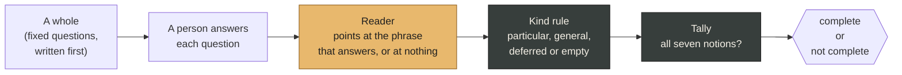

<p align="center">
  
</p>

<h1 align="center">rai</h1>

<p align="center"><strong>A model that checks if a set is complete.</strong></p>

<p align="center">
  <a href="https://github.com/koherarchitecture/rai/releases/tag/v0.3.8"></a>
  <a href="LICENSE"></a>
  <a href="LICENSE-WEIGHTS-AND-DATA.md"></a>
  
  <a href="https://huggingface.co/prayasabhinav/rai"></a>
</p>
<p align="center">
  
  
  
  
  
  
  <a href="https://splitdomaincognition.org"></a>
</p>

---

rai checks whether a description answers every question of a form written in advance. It reads each typed answer with a small model and decides in plain code. It answers **complete** or **not complete**. It does not say what is missing, suggest wording or show a number.

Answers can be typed in English or, from 0.3.8, in Hinglish: Hindi in Roman letters, mixed with English as people type it (*"Joshi sir ke paas"*, *"kal subah"*). It reads Hinglish less well than English.

The model in rai only points. Given a question and an answer, it returns the phrase in the answer that answers the question, or nothing. It cannot write a word of its own. Every decision after that is made by code short enough to read in a few minutes.

The name is the Hindi word for a mustard seed, राई, the proverbial smallest thing.

## Contents

- [Quick start](#quick-start)
- [Scope: the kind of set rai is for](#scope-the-kind-of-set-rai-is-for)
- [How to use](#how-to-use)
- [What it is for](#what-it-is-for)
- [Use cases](#use-cases)
- [How it works](#how-it-works)
- [The seven notions of completeness](#the-seven-notions-of-completeness)
- [The wholes](#the-wholes)
- [How well the reader reads](#how-well-the-reader-reads)
- [What rai will never do](#what-rai-will-never-do)
- [Model, data and training](#model-data-and-training)
- [Repository layout](#repository-layout)
- [Licences and credit](#licences-and-credit)

## Quick start

```bash
git clone https://github.com/koherarchitecture/rai.git
cd rai
python3 -m venv .venv
.venv/bin/pip install -r requirements.txt

# the trained reader, 122 MB, from this release
curl -L -o rai-reader-0.3.8.tar.gz https://github.com/koherarchitecture/rai/releases/download/v0.3.8/rai-reader-0.3.8.tar.gz
mkdir -p runs && tar -xzf rai-reader-0.3.8.tar.gz -C runs/    # creates runs/rai-0.3.8/

.venv/bin/python -m rai ask wholes/stone.yaml
```

The reader can also be loaded straight from Hugging Face as `prayasabhinav/rai`; see [Use it from Python](#use-it-from-python).

Once the reader is downloaded, everything runs locally. Nothing you type is sent anywhere or kept after you quit.

| command | what it does |
|---|---|
| `python -m rai ask wholes/stone.yaml` | asks one whole's questions, reads each typed answer and decides notions 1 and 2 in code. The other five notions are not in code yet, so on its own it always ends *not complete*; it is a way to watch the reader work |
| `python -m rai tally wholes/stone.yaml` | the same tally with no model: a person marks each question and each notion by hand |

Tested with Python 3.12, torch 2.9 and 2.14, transformers 5.17, on macOS (Apple silicon) and Linux (ARM64).

## Scope: the kind of set rai is for

**rai is not a general completeness checker.** It checks one kind of set: a **fixed form**, a short list of questions written before anyone answers, where **every question asks for a concrete particular** and every answer is a **short typed phrase**.

- **A form** describes one thing or one event. The shapes are old ones: the catalogue fields of an object (colour, size, marks, where it came from), the circumstances of an event (what, where, when, how long, who), a recipe (what, how much, in what order, how long), an inventory (what, how many, where).
- **A particular** is something another person could check: a name, a number, a place, a time or a length of time, a colour, a comparison with a named thing, a mark and where it is.
- **An answer** is a phrase or a short sentence, typed as a person would say it: *Dark grey with a rusty patch.* *About ten minutes.* *The shared drive, in the Q3 folder.*
- **A form has as many questions as its subject needs**; each is an equal share. The *seven* in rai are the seven notions of completeness, the ways a description is judged, not a number of questions.
- **rai's question** about each answer is only: does it answer this question, and where? Never whether the answer is right, good or enough.

An example of a form in scope, one of those the reader was trained on:

> **a stone**
> 1. What colour is it?
> 2. How big is it, against a coin or your thumb?
> 3. What shape is it?
> 4. How does it feel — rough, smooth, cold, gritty?
> 5. Does it have any mark, crack, line or speck? Where?
> 6. Where did you pick it up?

**Out of scope:** judging quality, truth or sufficiency; questions whose answer is a reason, an opinion or an argument; long answers of more than a few sentences; free documents with no form behind them, such as proposals, essays or code; and any use where rai's word decides something for somebody other than the person who wrote the answers.

The artwork form, which the reader **is** trained on, is the same shape applied to something people actually keep records of:

> **an artwork**
> 1. What is it made of?
> 2. How big is it?
> 3. Who made it?
> 4. When was it made?
> 5. What is it called?
> 6. Is there a signature, inscription or label on it? Where?
> 7. Where is it now?
> 8. Where was it before?

A form in scope that the reader was **not** trained on, and on which it does less well:

> **an equipment return**
> 1. What is being returned?
> 2. What condition is it in, and is there any damage? Where?
> 3. Is anything missing from it?
> 4. When was it taken out, and when is it being returned?
> 5. Where is it now?

**The trained domain is narrower than the scope.** The shipped reader was trained on nineteen forms. The first ten are about everyday objects and moments and cover all four shapes above (the stone and the coin are catalogue fields, the queue and the walk are circumstances, the tea is a recipe, the pocket is an inventory). The eleventh is **the record of an artwork** (`wholes/artwork.yaml`): what it is made of, how big it is, who made it and when, what it is called, what marks are on it, where it is now and where it was before. Eight more, added in 0.3.5, are everyday events and things: a phone call, a repair, something lost and found, an auto or cab ride, the last message sent, the last form filled in, the door of your room, the first screen of your phone. The form can describe anything that fits the rules above; the reader has seen only these nineteen.

### How far the scope reaches, measured

The reader was trained on the 116 questions of the nineteen trained forms. From 0.3.5 it is also measured on four forms it never trains on, kept apart in `tests/unseen-forms/`: a water bottle, a phone that ran out of charge, being caught in the rain, and a search that failed. `scripts/synth.py` stops if a training question repeats one of theirs. Each of their 24 questions has two honest answers, read with the form's stem and again without it, an evasive answer each way, and an answer to another question of the same form: 168 rows in `tests/testset-unseen-v1.jsonl`.

| unseen forms | 0.3.4, at 16.24 | 0.3.5, at 12.67 | 0.3.6, at 9.30 | 0.3.7, at 8.92 | 0.3.8, at 11.53 |
|---|---|---|---|---|---|
| honest answers, with the stem | 25 of 48 | 32 of 48 | 31 of 48 | 33 of 48 | 31 of 48 |
| honest answers, without the stem | 14 of 48 | 27 of 48 | 30 of 48 | 33 of 48 | 33 of 48 |
| non-answers counted | 0 of 72 | 0 of 72 | 0 of 72 | 0 of 72 | 0 of 72 |

16.24 is the lowest threshold at which 0.3.4 counts no non-answer on all three test sets; at its shipped 14.89 it counted two off-question answers on these forms. On a new form rai still refuses non-answers but misses more real ones than on the trained forms, and so says *not complete* when the description is complete. The unseen answers were written for this set in the same plain style as the training templates; how rai does on answers people type in their own words is still not measured.

## How to use

### 1. Install

**What you need**

- **Python 3.10 or newer** (tested with 3.12). Check with `python3 --version` (Windows: `py --version`).
- **git**, to clone the repository.
- **About 1.5 GB of disk space**: PyTorch is most of it, the reader is 127 MB.
- **No GPU.** rai runs on an ordinary laptop CPU. No account, key or network connection is needed once it is installed.

**macOS and Linux**

```bash
git clone https://github.com/koherarchitecture/rai.git
cd rai
python3 -m venv .venv
.venv/bin/pip install -r requirements.txt
```

**Windows (PowerShell)**

```powershell
git clone https://github.com/koherarchitecture/rai.git
cd rai
py -m venv .venv
.venv\Scripts\python -m pip install -r requirements.txt
```

On Windows, use `.venv\Scripts\python` wherever this README says `.venv/bin/python`.

**Get the trained reader.** Download it from the release and extract it into `runs/`. On macOS and Linux:

```bash
curl -L -o rai-reader-0.3.8.tar.gz https://github.com/koherarchitecture/rai/releases/download/v0.3.8/rai-reader-0.3.8.tar.gz
shasum -a 256 rai-reader-0.3.8.tar.gz    # Linux: sha256sum
mkdir -p runs && tar -xzf rai-reader-0.3.8.tar.gz -C runs/
```

The checksum should read `fef8c50383c19b9023942315bff83ea7c5bd93a649c75fd4c4858457241441dd`. You should end up with `runs/rai-0.3.8/model.safetensors`. On Windows (PowerShell), where `curl` alone means something else, use `curl.exe`:

```powershell
curl.exe -L -o rai-reader-0.3.8.tar.gz https://github.com/koherarchitecture/rai/releases/download/v0.3.8/rai-reader-0.3.8.tar.gz
Get-FileHash rai-reader-0.3.8.tar.gz -Algorithm SHA256    # prints the same hash in capitals
mkdir runs
tar -xzf rai-reader-0.3.8.tar.gz -C runs
```

The file can also be downloaded from the [release page](https://github.com/koherarchitecture/rai/releases/tag/v0.3.8) in a browser.

**Or load it from Hugging Face** instead of downloading by hand: pass `prayasabhinav/rai` wherever a model folder is asked for. It needs a connection the first time, then runs from the Hugging Face cache.

**Check the install**

```bash
.venv/bin/python tests/test_tally.py          # seven "ok" lines; no model needed
.venv/bin/python tests/test_reader_v03.py     # the trained reader on the test set
```

The second should end with `ok 0.3.0: does more than 0.2.0 by 145 honest answers; the shipped threshold 9.3 passes no non-counting answer`, meaning it finds 145 more real answers than the untrained reader and counts no evasive one.

**If something goes wrong**

| message | cause | fix |
|---|---|---|
| `no file named model.safetensors ... in directory runs/rai-0.3.8` | the reader is not extracted, or is in the wrong folder | extract the archive into `runs/` so that `runs/rai-0.3.8/model.safetensors` exists |
| `ModuleNotFoundError: No module named 'rai'` | Python was started outside the repository folder | run commands from inside `rai/`, or add the folder to `PYTHONPATH` |
| `ModuleNotFoundError: No module named 'torch'` | the virtual environment's Python was not used | use `.venv/bin/python`, not the system `python3` |
| `ensurepip is not available` when making the virtual environment | on Debian and Ubuntu, venv support is a separate package | `sudo apt install python3-venv`, then make the environment again |
| a long download on first use of `test_reader_v02.py` | that test uses deepset's untrained reader from Hugging Face | expected once; later runs use the cache |

### 2. Run a shipped set

```bash
.venv/bin/python -m rai ask wholes/stone.yaml        # or wholes/artwork.yaml, wholes/key.md
```

rai prints each question in turn; type an answer and press Enter. After the last answer it prints its verdict, either *complete* or *not complete*. For example:

```
— a stone —
What colour is it? Dark grey with a rusty patch.
How big is it, against a coin or your thumb? About the size of my thumbnail.
What shape is it? A wedge.
How does it feel — rough, smooth, cold, gritty? Rough and cold.
Does it have any mark, crack, line or speck? Where? A white speck near one end.
Where did you pick it up? The path behind the post office.
not complete
```

`ask` checks two of the seven notions of completeness in code and leaves the other five unmarked, so it always ends *not complete*; it is the way to watch the reader work. Step 5 shows how to mark the other five. `.venv/bin/python -m rai tally wholes/stone.yaml` runs the same tally with no model, marked by hand.

### 3. Write your own set in Markdown

Add a file ending in `.md` to `wholes/`. The format:

```markdown
# a key

One line saying what is being described. Any line that is not the title, a numbered question or a stem is a note and is ignored.

1. What is it made of, and what colour is it?
   - stem: It is made of
2. How long is it, against your finger?
   - stem: It is about as long as
3. Where is it right now?
   - stem: It is
```

- `# ` starts the name of the thing, once, at the top.
- Each question is a numbered line: `1.` or `1)`.
- `- stem:` under a question is optional: the words an answer usually starts with. It helps the reader find short answers and is never shown or counted. Keep it free of content (*It is made of*, never *It is made of plastic or*).
- Every question gets an equal share of the form. Nobody writes weights.

Stay inside the [scope](#scope-the-kind-of-set-rai-is-for): one thing or event, every question answered by a short particular. [`wholes/key.md`](wholes/key.md) is a complete example, and [`docs/wholes.md`](docs/wholes.md) has the rules that keep a question checkable. The ten shipped sets are YAML; both formats load the same way.

### 4. Run your set

```bash
.venv/bin/python -m rai ask wholes/key.md
```

### 5. Use it from Python

```python
from rai.reader import Reader
from rai.whole import load_whole
from rai.ask import read_answers, READER
from rai.kind import counts
from rai.tally import word

reader = Reader(READER)                       # runs/rai-0.3.8; or "prayasabhinav/rai" from Hugging Face
whole = load_whole("wholes/stone.yaml")
answers = {"colour": "Dark grey with a rusty patch.", "size": "About the size of my thumbnail.",
           "shape": "A wedge.", "feel": "Rough and cold.", "marks": "A white speck near one end.",
           "from": "The path behind the post office."}

found = read_answers(whole, answers, reader)  # question id -> counted or not
passed = set()
if all(found.values()):
    passed.add("declared_parts")
if all(counts(a) for a in answers.values()):
    passed.add("answer_kind")
passed |= {"two_readers", "frame_roles", "conditions_closed", "no_dangling_names", "nothing_left_to_ask"}   # marked by people until they are in code
print(word(passed))                           # complete
```

Change the answer about marks to *The path behind the post office.*, an answer to a different question, and the same code prints *not complete*: the reader finds no phrase in it that says what marks the stone has, so the part counts as absent. An answer the reader finds but is unsure of counts as absent the same way, when its margin is under the threshold of 9.30. That is a false absent, the safe kind of error: whoever wrote the answers looks again.

`read_answers` applies the reader, the verbatim guard, the threshold and the kind rule together. `word` is the only thing that should reach a person.

rai is a model and a small library. Anything built on it calls it the same way and keeps its own interface.

The same code works for a Markdown set: `load_whole("wholes/key.md")`.

## What it is for

A description can sound finished and still leave out a part. People are bad at noticing the part that is not there, because a person fills a familiar gap without noticing it. A form, written down before anyone answers, turns that absence into something that can be checked: each question is either answered or not.

rai does that check with the model kept out of the verdict. The model is asked only where in an answer the reply to a question sits. What counts as an answer, and what complete means, is decided in code and in a YAML file anyone can read and change. The person who wrote the answers gets *complete* or *not complete* back, and decides what to do with it.

## Use cases

| use | in short |
|---|---|
| Check a description against its form | write the form's questions once, answer them, tally; see the [scope](#scope-the-kind-of-set-rai-is-for) |
| Build on it | a program of your own that calls `read_answers()`, keeps its own interface, and still gives the person only *complete* or *not complete* |
| Your own sets | a Markdown file in `wholes/`, within the scope; see [How to use](#how-to-use) |
| Check a record of an artwork | a trained form: medium, size, maker, date, title, marks, where it is, where it was |
| A small benchmark | 576 labelled test answers over three test sets, and 23,200 training pairs, for extractive readers |
| A worked example | a model limited to a small, checkable question, with every decision in readable code |

Examples, and what rai must never be used for, are in [`docs/use-cases.md`](docs/use-cases.md).

## How it works


```mermaid
flowchart LR
    A["A whole<br/>(fixed questions,<br/>written first)"] --> B["A person answers<br/>each question"]
    B --> C["Reader<br/>points at the phrase<br/>that answers, or at nothing"]
    C --> D["Kind rule<br/>particular, general,<br/>deferred or empty"]
    D --> E["Tally<br/>all seven notions?"]
    E --> F{{"complete<br/>or<br/>not complete"}}
    classDef lang fill:#E8B86D,stroke:#8E5E1C,color:#1f1f1f
    classDef code fill:#373E3C,stroke:#1f1f1f,color:#f5f0e6
    class C lang
    class D,E code
```

The work is split the way [Split-Domain Cognition](https://splitdomaincognition.org) describes: the model does language work, and the judgement lives in code anyone can read.

1. **A whole is a set of questions** about one thing, written before anyone answers. Each question has a short content-free stem (*It is …*, *It feels …*) that helps the reader and is never shown or counted. A question's weight is its share of 1 by position: six questions, one sixth each. See [`docs/wholes.md`](docs/wholes.md).
2. **The reader points.** For each question, a 33-million-parameter extractive model finds the phrase in the typed answer that answers it and gives a margin: how far its best phrase beats the choice of *no answer*. The phrase must appear in what was typed, word for word, or it does not count. The margin must clear a fixed threshold, 11.53, set in `rai/ask.py` beside the reader it was measured for. See [`rai/reader.py`](rai/reader.py).
3. **A kind rule in plain code** decides whether the answer is a checkable particular or something that does not count: deferred (*not sure*, *later*, *idk*), general (*lots of things*, *the usual*, *someone*) or empty. See [`rai/kind.py`](rai/kind.py). From 0.3.7 a second rule, [`rai/fit.py`](rai/fit.py), refuses a bare number or label of the wrong kind: *7th* does not answer *where*, *Page 17* does not answer *when*. From 0.3.8 the kind rule also refuses vague and judging answers in Hindi and Hinglish (*koi*, *kisi ke paas hogi*, *sab kuch*, *shayad*, *sasta tha*).
4. **The tally** checks the seven notions of completeness. A description is **complete when it passes all seven**, in any order. They are seven parts, not a sum: nothing is added up and no value is kept. Anything short of all seven is *not complete*, and which notions passed is never shown. See [`rai/tally.py`](rai/tally.py).

Any doubt counts as absence. If the reader is unsure of a phrase, if an answer hedges, or if a question is left blank, the result is *not complete*.

Full detail in [`docs/how-it-works.md`](docs/how-it-works.md).

## The seven notions of completeness

A notion of completeness is a way a **description** can be complete. It is never a property of the thing described. All seven bear on the same one description at once.

| notion | a description is complete under it when | decided in this release by |
|---|---|---|
| declared parts | every question in the whole is answered | the reader and the tally |
| answer kind | each answer is a checkable particular, or an owned position for a *why* | the kind rule (particulars only in this release) |
| two readers | every part is found by two independent readings; doubt is absence | a person |
| frame roles | inside each answer, every role its verb needs is filled | a person |
| conditions closed | every *when X* has its *when not X*; every failure named has its response | a person |
| no dangling names | every thing named in an answer is itself described somewhere | a person |
| nothing left to ask | a second person, given the description, has no question they still need | a person |

The seven have no order and no rank. **Complete means all seven.** That rule is written down in [`notions/set-01.yaml`](notions/set-01.yaml), and rai's output means *complete under set 01* and nothing wider. Set 01 is frozen; another set of seven can be added beside it. See [`docs/notions.md`](docs/notions.md).

## The wholes

Nineteen wholes ship with rai, and the reader is trained on all of them: ten everyday objects and moments, the record of an artwork, and eight everyday events and things added in 0.3.5.

| whole | the thing |
|---|---|
| `stone` | one stone in your hand |
| `handful` | a handful of gravel, counted |
| `coin` | one coin from your pocket |
| `leaf` | one leaf |
| `queue` | a queue you stood in |
| `wait` | a wait |
| `tea` | the tea you last made |
| `walk` | the walk to the shop or the stop |
| `pocket` | what is in your pocket or bag |
| `sound` | a sound you can hear now |
| `artwork` | the record of one artwork |
| `call` | a phone call you made |
| `repair` | something you fixed or tried to fix |
| `lost` | something you lost and found again |
| `ride` | an auto or cab ride |
| `message` | the last message you sent |
| `paperwork` | the last form you filled in |
| `door` | the door of your room |
| `screen` | the first screen of your phone |

Every question can be answered with a particular: a colour, a count, a comparison with a coin or a thumb, a place, a length of time. *How big is it?* has no checkable answer; *how big, against a coin?* does. A whole is a YAML file, and anyone can write one. The format and its rules are in [`docs/wholes.md`](docs/wholes.md).

## How well the reader reads

Measured on seven test sets it never trained on, at **one threshold, 11.53**, the smallest margin that lets no non-answer through in any of them, with both kind rules applied:

| test set | honest answers counted | non-answers counted |
|---|---|---|
| **test set v1**, the first ten everyday forms | **152 of 180** | **0 of 179** |
| **artwork records** | **18 of 24** | **0 of 24** |
| **unseen forms**, never trained on | **64 of 96** | **0 of 72** |
| **rai ka pahad rounds**: questions two people write for each other about a small point nobody can settle, no stem | **48 of 60** | **0 of 60** |
| **people's typing**, set 1: lowercase, no full stops, digits, *ji* and *di* on names | **21 of 24** | **0 of 18** |
| **people's typing**, set 2 | **42 of 46** | **0 of 33** |
| **Hinglish**: answers in Hindi typed in Roman letters, to questions in English and in Hinglish | **27 of 58** | **0 of 54** |

0.3.7, scored the same way at its own threshold, 8.92, counts 157, 20, 66, 52, 21, 44 and 16. Each version's threshold is set on its own reader, so the two thresholds cannot be compared. Hinglish is still read much less well than English, 27 of 58 against 152 of 180.

Three probes written before 0.3.7's last training and never trained on are in `tests/probes/`, and are not part of the threshold. Scored with rai's full decision on both readers, each of the 131 names in the file paired in turn with a *who* question and every third name with a *where* or *when*: **125 of 131** Indian names counted for *who* (0.3.7: 127), none for *where* or *when*; **16 of 20** answers that mean the right thing in free wording (0.3.7: 17), with **one of 10 non-answers counted**, as in 0.3.7; **20 of 20** in a last batch of people's typing, none of 12 non-answers counted.

No phrase in any test set appears in the training data, and `scripts/synth.py` and `scripts/synth_live.py` stop if one would. Counting a non-answer is the error that matters: it can turn *not complete* into *complete*, while a missed real answer only sends the writer back to look again.

What these numbers do and do not say:

- **The threshold is chosen on the same sets it is reported on.** The probes are the check against that.
- **Every test answer was written for these sets in Claude Code**, including the people's-typing sets, which stand in for people, and the Hinglish set, whose labels a Hindi speaker read. How rai does on rounds written by people who use it is still not measured.
- **One row was removed from test set v1** (now 359): *"Which would you miss first if it fell out?" / "The keys, since I moved in, 2023."*, labelled a non-answer although `scripts/synth.py` says those two questions' answers can swap. Every version above is scored without it.
- **Three training runs, averaged**, with seeds 7, 1 and 2. One run alone moves the count by about thirty.

Reproduce: `python scripts/eval_reader.py tests/testset-v1.jsonl tests/testset-artwork-v1.jsonl tests/testset-unseen-v1.jsonl tests/testset-kapahad-v1.jsonl tests/testset-typing-v1.jsonl tests/testset-typing-v2.jsonl tests/testset-hinglish-v1.jsonl runs/rai-0.3.8`, or run every check with `bash scripts/check.sh`.

## Running rai as a service

`rai/serve.py` puts `read_answers` behind HTTP for programs that call rai from elsewhere. Every request needs a key; without it the server answers 401 and reads nothing. It stores no answer and logs no request.

```bash
RAI_API_KEY=<a key you choose> python -m rai.serve 8080
curl -X POST localhost:8080/read_answers -H "X-API-Key: <the key>" \
  -d '{"questions": [{"id": "q1", "text": "who fills it"}], "answers": {"q1": "sunil bhai fills it"}}'
# {"found": {"q1": true}}
```

`deploy/` holds a Dockerfile and `make-caprover-tar.sh` for running it on a CPU server. rai cannot be run in Ollama: Ollama serves text generation and embeddings, rai is a reader that points at a span, and its judgement is plain Python around the model. Running `rai.serve` on your own machine is the equivalent.

## What rai will never do

- Say why a description is not complete, or what is missing.
- Suggest wording, or write a word of its own.
- Show a score, a fraction or a percentage.
- Keep anything anybody types, or count who uses it.
- Claim more than *complete under set 01*.
- Be used as a step in a decision that affects somebody else, such as an application or an assessment. Its word is for the person who wrote the answers.

## Model, data and training

**0.3.8 is the average of two readers' weights**, 0.4 of 0.3.7 and 0.6 of a reader taught Hinglish by a larger model. Averaging the weights of models trained from one starting point gives a working model (WiSE-FT and model soups, Wortsman et al. 2022), and both of these started from deepset's MiniLM. The reader taught Hinglish counted 34 of 58 Hinglish answers alone but only 102 of 131 Indian names; the average keeps 125 of the names and 27 of the Hinglish answers.

- **The reader** is a question-answering model trained further from [deepset/minilm-uncased-squad2](https://huggingface.co/deepset/minilm-uncased-squad2), itself deepset's fine-tune of Microsoft's [MiniLM-L12-H384-uncased](https://huggingface.co/microsoft/MiniLM-L12-H384-uncased) on SQuAD 2.0. Same architecture, 33M parameters, nothing added. [`MODEL-CARD.md`](MODEL-CARD.md)
- **The teacher**, used in training and not shipped, is [HingBERT](https://huggingface.co/l3cube-pune/hing-bert) (L3Cube Pune, Nayak and Joshi 2022, CC-BY-4.0): BERT-base trained further on 52.9 million romanised Hinglish sentences, which uses the same tokeniser vocabulary as MiniLM. It was taught SQuAD 2.0 (`scripts/squad_rows.py`) and then rai's rows. On the Hinglish rows, the Hinglish reader was trained to match the teacher's start and end scores for each word, after both sets were rescaled to mean 0 and spread 1 ([`scripts/distil.py`](scripts/distil.py)).
- **The training data** is 34,800 synthetic question-and-answer pairs with labels known by construction. Of these, 29,000 are the rows 0.3.7 trained on: 23,200 template rows over nineteen forms from [`scripts/synth.py`](scripts/synth.py), and 5,800 rows of questions as people write them from [`scripts/synth_live.py`](scripts/synth_live.py). The other 5,800 are Hinglish, from [`scripts/synth_hinglish.py`](scripts/synth_hinglish.py): answers in Hinglish, with the words people put around them, to questions in English and in Hinglish. The questions, stems and most answers were written in Claude Code, which is trained on other people's words; 0.3.6's answers were written by Comma v0.1, trained only on openly licensed text. It contains no person's answers. [`DATA-CARD.md`](DATA-CARD.md)
- **To train it again**: `PYTHON=.venv/bin/python bash scripts/train-full.sh`. It trains 0.3.7 (three seeds, averaged), the teacher, and the Hinglish reader (three seeds, averaged), then averages 0.3.7 and the Hinglish reader into `runs/rai-0.3.8` and runs the test. The teacher is 110M parameters and needs a GPU with about 20 GB free; the rest runs where 0.3.7 did, about 3 minutes a seed on a Mac's GPU.

## Repository layout

```
rai/            the package: reader, kind rule, tally, the two commands, training
notions/        set-01.yaml, the seven notions of completeness
wholes/         nineteen question sets (eighteen everyday things and an artwork record), plus key.md as a Markdown example
scripts/        synth.py (training data), build_testset.py, build_unseen_testset.py, eval_reader.py, train-full.sh, check.sh
tests/          the contract test, tally tests, reader tests, test set v1, the artwork and unseen test sets, unseen-forms/, recorded results
data/           train-synth.jsonl, the 23,200 training pairs
docs/           how it works, use cases, the notions, the wholes
assets/         the rai mark and the Koher logo
```

Run the tests:

```bash
bash scripts/check.sh                              # every check: the contract, the tally, the reader, the leak guard
.venv/bin/python tests/test_reader_v02.py          # the untrained reader; downloads it once
```

## Licences and credit

- **Code:** GNU AGPL-3.0, in [`LICENSE`](LICENSE).
- **Weights and training data:** CC-BY-4.0, in [`LICENSE-WEIGHTS-AND-DATA.md`](LICENSE-WEIGHTS-AND-DATA.md).
- **Built on:** deepset's [minilm-uncased-squad2](https://huggingface.co/deepset/minilm-uncased-squad2) (CC-BY-4.0) and Microsoft's [MiniLM](https://huggingface.co/microsoft/MiniLM-L12-H384-uncased) (MIT). Both are credited here and in the model card, as their licences ask.
- **The idea:** the split between reading and deciding comes from [Split-Domain Cognition](https://splitdomaincognition.org), a principle that is nobody's property.

To cite rai, see [`CITATION.cff`](CITATION.cff).

---

<p>
  <a href="https://koher.app"></a>
  rai is made by <a href="https://koher.app">Koher</a>, a practice building free AI tools that keep judgement in code anyone can read.
</p>
